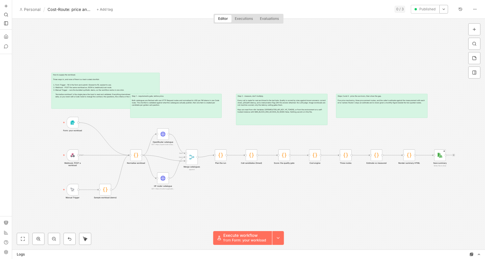

# Cost-Route

One page that prices the same AI workload across three procurement routes and shows where the
buyer's own estimate went wrong. Every measured figure on it comes from calls that were actually
made and billed, every assumption is labelled as an assumption, and the two are never mixed. The
page is a single self-contained HTML file: it opens in a browser with no server, no build step and
no key.

**Read the report: https://therealmaddieli.github.io/cost-route/**

---

## The decision it models

Four steps, in this order. The ordering is the whole point.

**1. Requirements gate, before price.** A model that hallucinates a contract clause is not a cheap
option, it is an unusable one, and a table that ranks it cheapest is worse than useless. So the
quality bar applies first and only survivors get priced. Quality is measured against a **golden
set**: 10 to 15 examples with known correct answers, including deliberate hard cases, answered for
real and scored by share correct. Latency is a stopwatch on the real call. Hallucination is a flag
with the offending example attached, never a confident score. Image quality is not machine-scored
at all, because whether a picture is good is a human judgement.

**2. Price mechanics, all five of them.** Per-token price is the number everyone looks at and it is
one of five. The catalogues also price cached input, tiered rates above a prompt-size threshold,
reasoning tokens the model bills for but never shows you, and per-call charges (web search, image
output) that sit outside token arithmetic entirely. Roughly an order of magnitude separates the
list rate from the rate a well-structured prompt actually pays.

**3. Procurement route.** Three ways to buy the same capability, and the price is only part of the
trade:

| Route | What it is | Cost basis |
|---|---|---|
| **A** | A closed API model | Quoted price per token |
| **B** | Open weights, served by a third party | Quoted price per token, per provider |
| **C** | Open weights, self-hosted on your own hardware | **An estimate from named assumptions, never a price** |

Route C is the row that keeps the table honest: it has no monthly figure, because no vendor charges
for it and inventing one would be the exact mistake the page exists to prevent. The route table
carries the things a price cannot: licence terms, gating, how many providers can serve a model, and
what self-hosting adds in operations.

**4. Head-to-head on the shortlist you already have.** The buyer supplies the models, the sample
and the golden set; the tool runs them for real and reports measured quality, measured latency,
measured token consumption and measured cost per unit of work. The buyer's own estimate is an input,
because the gap between their estimate and the measurement is the punchline.

---

## What is on the page

Two workloads, as tabs: **legal contract review** (text, 14 questions across six candidates: GPT-4o mini, GPT-5.6 Sol, Claude Fable 5.1, DeepSeek V4 Flash, DeepSeek V4 Pro and Kimi K3)
and **image generation** (one prompt, two models, two runs each).

For each workload the page now opens with the orientation it used to lack, and then makes one
argument:

- **How to read it** — the three steps, the `measured` / `assumed` vocabulary, and the route key,
  before any table.
- **Your own numbers** — the one interactive panel, now at the top rather than buried at the foot of
  the page. You move your **volume, prompt size, answer length and your own estimate**; everything
  measured is locked and timestamped. The measurement is held fixed in the arithmetic and not only
  in the markup, so a locked field cannot be typed into or set by script.
- **Where the estimate went wrong** — a waterfall that names each reason the estimate missed and
  what each reason was worth.
- **Every candidate, at your volume** — the quality gate, latency spread, list price beside the
  effective blended rate after caching, and cost per call and per month at your inputs.
- **The three procurement routes** — A, B and C side by side with the concrete non-price trade-offs.
- **Assumptions this page rests on** — one box naming the synthetic data, the golden set, the
  quality bar, the buyer's inputs, the fetch timestamp, and the route C estimate.
- **What this tab cannot tell you** — the limitations, on the page rather than only in this file.

---

## Quick start

**Prerequisites:** Node 20 or newer (the scripts use the built-in `fetch` and `node:test`) and
Python 3 for the smoke test. No `npm install`: there are no dependencies.

```bash
git clone https://github.com/therealmaddieli/cost-route
cd cost-route

# 1. Keys. Copy the template and fill it in. .env is gitignored; never commit real keys.
cp .env.example .env
#   OPENROUTER_API_KEY  https://openrouter.ai/keys
#   HF_TOKEN            https://huggingface.co/settings/tokens  (Inference Providers permission)
#   BFL_API_KEY         optional, only for the parked FLUX leg

# 2. Free checks. Proves every endpoint answers before anything is spent.
python3 scripts/smoke_test.py            # add --images to also prove the image leg (~$0.01)

# 3. See what a run would send, and spend nothing.
node scripts/benchmark.mjs --dry-run

# 4. Run the goldens for real. Sequential on purpose: latency is one of the three numbers
#    the gate decides on, and parallel calls would measure the queue instead of the model.
node scripts/benchmark.mjs
node scripts/benchmark.mjs --workload samples/workload.image.json

# 5. Generate the page. --fetch refreshes both catalogues first; without it the last saved
#    catalogue is used, so the same inputs reproduce the same page.
node scripts/report.mjs --fetch
open out/report.html

# 6. Tests. No framework, no dependencies.
node --test tests/
```

Optional extras:

```bash
node scripts/price.mjs                                   # the cost and route tables on stdout
node scripts/price.mjs --offline                         # use the saved catalogue, fetch nothing
node scripts/report.mjs --workload samples/workload.legal.json --out out/my-report.html
node scripts/shot.mjs out/report.html out/shots 360 400  # responsive screenshots (needs Chrome)
node scripts/artifact.mjs                                # the hostable variant of the page
```

**What a full run costs:** the current text leg cost **$0.96** in API spend, and **$0.80 of that
was Claude Fable alone** — the frontier model dominates the bill, which is the finding rather than
a caveat. The image pair is separate. `--items 3` on the benchmark runner is a
cheap way to smoke the whole pipeline.

---

## The n8n workflow



`workflow.json` imports into n8n as a **sixteen-node** orchestration of the same decision, with
**three ways to supply the workload** — and none of them a hard-coded shortlist:

| Entry point | How it is used |
|---|---|
| **Form** (`cost-route-form`) | The customer-facing path. Fill in the contract, 10–15 questions with known answers, the criteria and the shortlist, submit, and the form returns the run's summary. |
| **Webhook** (`POST /webhook/cost-route`) | The programmatic path. POST the same workload as JSON. |
| **Manual Trigger** | Runs the bundled synthetic demo, so the workflow still works in one click. |

All three land on **Normalise workload**, the single node that reads and validates the input and
names anything missing (`workload rejected - candidates: supply at least one …`). Everything
downstream reads the workload from the data, so changing the contract, the questions, the criteria
or the models never means editing a Code node.

From there: two raw HTTP Request nodes fetch the OpenRouter and Hugging Face catalogues, a Merge
node joins them and the workload into one input, then Code nodes normalise every rate to USD per
1M tokens in one place, validate the shortlist against what the catalogues actually publish, time
every call, apply the rule-based quality gate, price the survivors across the five mechanics,
compare the three procurement routes, build the estimate-versus-measured ledger, and render a
decision summary to HTML and to a file.

**Supplying a workload over the webhook.** The body is the workload itself:

```json
{
  "workload_name": "My supplier contracts",
  "workload_kind": "text",
  "answer_instruction": "Answer in ONE short sentence.",
  "contract": "<the document to review>",
  "golden_set": [
    { "id": "q1", "kind": "fact", "question": "How long is the initial term?",
      "expected": "24 months", "accept": ["24[\\s-]*months?"], "reject": [] }
  ],
  "candidates": [
    { "name": "GPT-4o mini", "slug": "openai/gpt-4o-mini", "source": "openrouter", "route": "A" }
  ],
  "quality_bar": { "min_correct_share": 0.75, "max_hallucinations": 0 },
  "latency_ceiling_ms": 15000,
  "monthly_requests": 20000,
  "buyer_estimate": { "assumed_input_tokens_per_request": 1500, "assumed_output_tokens_per_request": 50, "assumed_cost_per_month_usd": 18 }
}
```

`samples/workload.webhook.json` is a ready-to-post example. Keep the command on one line — a
backslash continuation with a trailing space silently ends the line, and curl then posts an empty
body:

```bash
curl -X POST http://localhost:5678/webhook/cost-route -H 'Content-Type: application/json' --data-binary @samples/workload.webhook.json
```

The webhook acknowledges with `{"message":"Workflow was started"}`; the run takes as long as the
model calls do, and the result is the `cost-route-summary.html` the last node writes.

Defaults cover anything left out (`route` from the source, `name` from the slug, 75% and 0
fabrications, a 15,000 ms ceiling, 1,000 requests a month). An image workload swaps `contract` and
`golden_set` for a single `prompt`, and is reported as not machine-scored — only the latency
ceiling gates it.

**It carries no secrets, and no credential stanzas.** Keys are read from **n8n Variables**
(`OPENROUTER_API_KEY`, `HF_TOKEN`) at run time, with the process environment as a guarded fallback.
Nothing key-shaped is in the file, so it is safe to publish and safe to diff.

> n8n 2.x blocks environment access inside nodes by default: `$env` throws `access to env vars
> denied` unless the instance sets `N8N_BLOCK_ENV_ACCESS_IN_NODE=false`. That is why the workflow
> reads Variables first — they are the supported path and they work on n8n Cloud. Found by executing
> the workflow, not by reading the docs.

**Import and run:**

1. In n8n: **Workflows → Import from File** and pick `workflow.json`.
2. Provide the two keys, either way:
   - **n8n Cloud, or any instance with Variables:** Settings → Variables → add
     `OPENROUTER_API_KEY` and `HF_TOKEN`.
   - **Self-hosted:** export the same two names in the environment and start n8n with
     `N8N_BLOCK_ENV_ACCESS_IN_NODE=false`.
3. Open the workflow and click **Execute workflow**. It writes `cost-route-summary.html` with the
   recommendation, the waterfall and the candidate table.

Two n8n defaults are off for this workflow and both are deliberate switches in the environment,
because a self-hosted instance can afford them and n8n Cloud should not have them on:

| Variable | Why |
|---|---|
| `N8N_BLOCK_ENV_ACCESS_IN_NODE=false` | `$env` throws `access to env vars denied` by default in n8n 2.x. Only needed for the environment fallback; the Variables path needs no flag. |
| `N8N_RESTRICT_FILE_ACCESS_TO=""` | The Read/Write File node is confined to an allow-list that defaults to `~/.n8n-files`, so **Save summary** is refused for any path outside it. Set this to the output directory instead if you would rather not lift it. `N8N_BLOCK_FILE_ACCESS_TO_N8N_FILES=false` alone is **not** enough — it only removes the extra block on n8n's own folder, not the allow-list. |

If the write is refused anyway, the run still succeeds: **Save summary** continues on error and the
HTML is downloadable from **Render summary HTML** / **Convert to file**.

The demo shortlist is three candidates × 14 questions: **42 calls, roughly $0.01–0.02** of
OpenRouter / Hugging Face spend. n8n plan credits do not pay for those model calls; the providers
bill them.

**One deliberate deviation from the repo pipeline:** the catalogue fetches are raw HTTP Request
nodes, but the benchmark calls run through n8n's timed HTTP helper inside a Code node, because the
HTTP Request node does not expose per-item timing and latency is one of the three numbers the gate
decides on. The alternative would have been an HTTP Request node with a latency column that is
quietly wrong, which is the failure mode this whole project exists to name.

Re-capture the canvas after editing the workflow:

```bash
# with n8n running locally and the workflow imported
node scripts/shot.mjs "http://127.0.0.1:5678/workflow/<workflow-id>" docs/n8n-canvas 1680 \
  --cookie="n8n-auth=<session-jwt>@127.0.0.1" --wait=".vue-flow__node" --no-sandbox
```

---

## Point it at your own workload

Everything is an input: the workload, the shortlist, the golden set, the volume and the buyer's
estimate. Nothing is hardcoded. One JSON file describes one workload.

1. **Copy a workload file** and edit it: `cp samples/workload.legal.json samples/workload.mine.json`.
2. **Fill in the inputs.** The fields that matter:

| Field | What it is |
|---|---|
| `workload_name`, `workload_kind` | `text` or `image`; the second picks the benchmark shape |
| `task_description` | One line, for the report |
| `sample_input_path` | The document to review (text workloads) |
| `prompt` | The exact string to send (image workloads) |
| `golden_set[]` | `{ id, kind, question, expected, accept[], reject[] }` — your known answers |
| `quality_bar` | `{ min_correct_share, max_hallucinations }` — the gate that runs before price |
| `latency_ceiling_ms` | Your ceiling, not a generic target |
| `monthly_requests` | Your volume |
| `buyer_estimate` | `{ assumed_input_tokens_per_request, assumed_output_tokens_per_request, assumed_cost_per_month_usd }` |
| `candidates[]` | `{ name, slug, route, source, provider? }` — `source` is `openrouter` or `huggingface` |

3. **Run it:** `node scripts/benchmark.mjs --workload samples/workload.mine.json`, then
   `node scripts/report.mjs --workload samples/workload.mine.json`.
4. **Check the report** and read the waterfall. If the gap between the estimate and the measurement
   is large, the reason is named and priced.

Add more than one `--workload` and the page renders them as tabs.

**Keep the golden set yours, and keep it adversarial.** The gate is only as good as the questions.
Include the cases you expect the cheap model to fail, and write `accept` / `reject` patterns that
would catch a fabricated figure rather than only a wrong one.

---

## Where the numbers come from

- **OpenRouter** — `GET https://openrouter.ai/api/v1/models`, no auth. Per-token pricing as strings,
  including cache reads, tier overrides and per-call charges.
- **Hugging Face** — `GET https://router.huggingface.co/v1/models` for per-provider pricing, and the
  model API for licence and gating metadata. Both units are normalised to USD per million tokens in
  exactly one place; the unit is printed on the report.
- **Black Forest Labs / FLUX** — no longer a build dependency. FLUX appears as a licence and
  distribution row read from the Hub card, labelled as read and never as measured.

The committed report reads its catalogues at **2026-09-15T16:39:21Z** and made its calls on
**2026-09-17**, and says both on the page. Prices move: re-running reproduces the method, not these
exact figures. The only signal a model may be withdrawn is its disappearance from the catalogue, so
slugs are never hardcoded in the renderer.

All workload data in this repository is **synthetic**: a made-up contract, made-up questions with
known answers, a made-up buyer estimate, and an invented one-sentence image prompt. No real client
documents, no scraped contracts, no real counterparty names.

---

## Repository layout

```
core/            the engine: catalogue, cost, routes, ledger, scorer, report renderer
scripts/         the CLIs: smoke test, price, benchmark, report, artifact, screenshots, workflow builder
tests/           the test suite (node --test, no dependencies)
samples/         the two demo workloads, the synthetic contract, the generated images
workflow.json    the n8n workflow that orchestrates the live calls
docs/            units.md (the one-place unit conversion) and the n8n canvas screenshot
index.html       the published report, a copy of the generated out/report.html
out/             generated output: catalogues, benchmark runs, the report (gitignored)
```

---

## Built with

**n8n** for orchestration — the workflow in `workflow.json` uses raw HTTP Request nodes for every
external call and Code nodes for the normalisation, scoring and cost arithmetic, so the same logic
runs in the repo and in the canvas.

**Claude Code** as the agentic coding tool. The benchmark runner, the ledger, the renderer, the test
suite and the report were written in sessions with it, and every measured claim the report makes is
backed by either a test or a saved run file.

---

## Limitations

- **One workload per kind, and a sample of one each.** These figures describe one contract and one
  image prompt. A different task has different token counts, a different cache hit rate, and may
  have a different winner.
- **The quality gate is evidence, not a guarantee.** 14 questions is enough to separate these
  candidates on this contract and not enough to promise anything about anyone else's.
- **Every text candidate is quoted through OpenRouter.** The route B candidates (DeepSeek V4,
  Kimi K3) are open weights, but their prices come from OpenRouter rather than the Hugging Face
  router, so the HF-router pricing path is not exercised on the text tab. The licence and gating
  facts still come from the Hub model cards, read by Hub id.
- **Image quality is not scored.** The pictures are on the page so a reader can make the judgement
  no script here makes.
- **Latency varies between runs, enough to change a verdict.** The page shows the spread per
  candidate rather than hiding it behind one number, and one image candidate's verdict turned on
  exactly this.
- **Route C is an estimate.** Built from named assumptions, not a quoted price, and never sorted in
  beside the two routes that do have prices.
- **A cache hit rate measured once.** Moving the prompt size scales the cached and uncached halves
  together, holding the measured hit rate fixed. A prompt with a different shape caches differently.

---

## Publishing

The public repository is these paths and nothing else:

```
core/  scripts/  tests/  samples/  workflow.json
docs/units.md  docs/n8n-canvas.png
README.md  LICENSE  index.html  .nojekyll
```

`scope.md` and `docs/day-*.md` are internal build notes, including planning and application
strategy, and are deliberately not published. `index.html` is a copy of the generated
`out/report.html`; GitHub Pages serves it from the repository root with `.nojekyll` marking the
directory as already-built so Jekyll does not touch it.

---

## License

MIT. See [LICENSE](LICENSE).

Built by Madeline Li.
